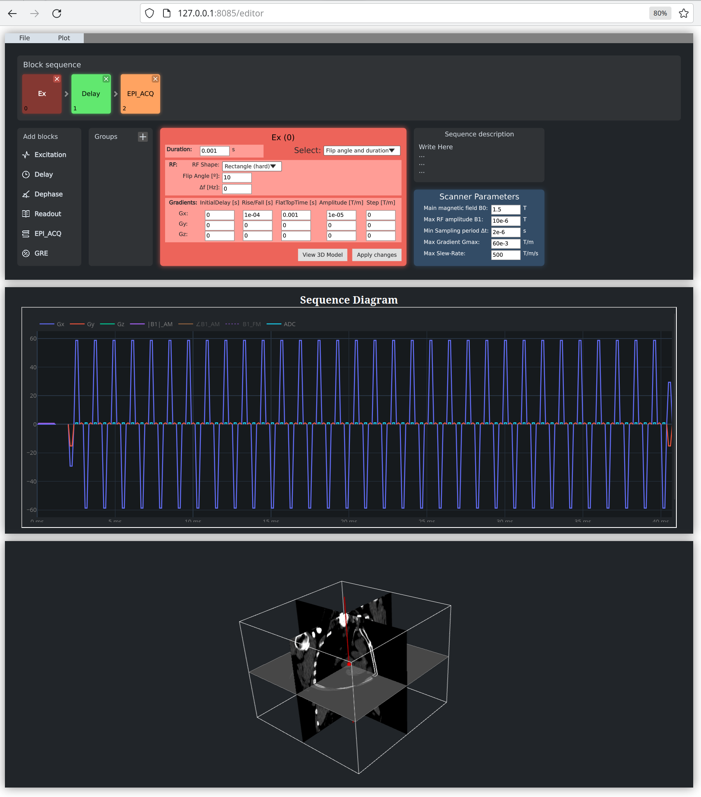

# Web MRI Sequence Editor

## Requirements
- Qt version v6.6
- CMake
- Emscripten (emsdk) v3.1.37
- Julia v1.10
- Node v20.11 and NPM

## Download and Instalation steps
1. Define environment variables:
```
  export QT=/path/to/Qt/6.6.2
  export EMSDK=/path/to/emsdk
```
2. Execute the following lines:
```
   git clone https://github.com/pvillacorta/WebMRISeq
   cd WebMRISeq
   ./configure.sh
   ./compile.sh
   ./serve.sh
```
3. Open browser and go to 127.0.0.1:8085/editor:

